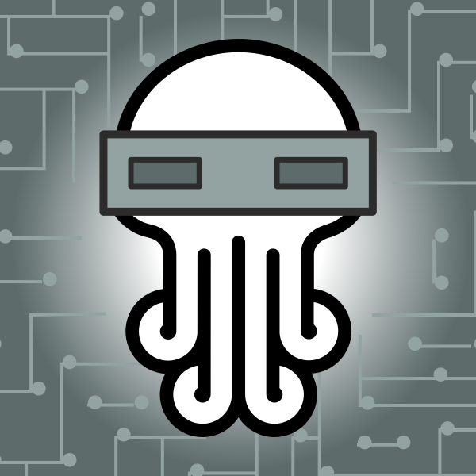

# nim-telegram-bot

- Easy `*.INI` & `*.MD` Customization. Single Binary, ~128 Kilobytes size. Tiny CPU & Net use. No dependencies.




## Compile

Get the Code:

```bash
git clone https://github.com/juancarlospaco/nim-telegram-bot.git
cd nim-telegram-bot/src/
```

Compile:

```bash
nim c -d:release --app:console --opt:size -d:ssl nim_telegram_bot.nim
strip --strip-all nim_telegram_bot
```

**Optional** (compress binary, half size):

```bash
upx --best --ultra-brute nim_telegram_bot
```

**Optional**, Compilation and Run for Development only (Hacks, testing, dev, etc)

```bash
nim c -r -d:ssl nim_telegram_bot.nim
```


## Config

- Rename the file `src/config.ini.TEMPLATE` to `src/config.ini`.
- Edit the file `src/config.ini` to set `api_key` and `polling_interval`.
- Edit the file `src/coc_text.md` to customize **Code Of Conduct** text.
- Edit the file `src/motd_text.md` to customize **Message Of The Day** text.
- Edit the file `src/donate_text.md` to customize **Donations** text.

You can hack any of the `*.ini` and `*.md` on the `/src/` folder to customize.


## Run

```bash
./nim_telegram_bot
```

**Optional**, you can use any Linux command like `chrt`, `trickle`, `firejails`, `docker`, `rkt` with the Bot too.


## Requisites

*For Compilation only!, if it compiles it does not need Nim nor Telebot.*

- [Nim](https://nim-lang.org/install_unix.html) `>= 0.18.0`
- [Telebot](https://github.com/ba0f3/telebot.nim) [`nimble install telebot`](https://nimble.directory/pkg/telebot)


### Single File

**Optional**, this is for advanced users only.

If you want to compile to 1 file, without any extra `*.md` files.

On the source code find and remove the lines:

```nim
helps_texts = readFile("help_text.md")
coc_text =    readFile("coc_text.md")
motd_text =   readFile("motd_text.md")
donate_text = readFile("donate_text.md")
```

On the source code find and uncomment the lines:

```nim
helps_texts = staticRead("help_text.md")
coc_text =    staticRead("coc_text.md")
motd_text =   staticRead("motd_text.md")
donate_text = staticRead("donate_text.md")
```

Recompile, it will Embed all the `src/*.md` files on the binary executable.

You will need to Recompile to change any content of the `src/*.md` files.

You can later delete all the `src/*.md` files.


### Performance Profiling

**Optional**, this is for advanced developers only.

Find and uncomment the line `import nimprof` on `nim_telegram_bot.nim`.

```bash
nim c --profiler:on --stacktrace:on -d:ssl -d:release --app:console --opt:size nim_telegram_bot.nim
./nim_telegram_bot
```

Then open the file `profile_results.txt`.


## Check code

**Optional**, this is for advanced developers only.

How to Lint the code.

```bash
nimble check
nim check src/nim_telegram_bot.nim
```


### CrossCompile

**Optional**, this is for advanced developers only.

Linux -> Windows, this allows to generate a `*.EXE` for Windows on Linux.

On Linux install all this packages:

```
mingw-w64-binutils mingw-w64-crt mingw-w64-gcc mingw-w64-headers mingw-w64-winpthreads mingw-w64-gcc-base mingw-w64-*
```

Usually only installing `mingw-w64-gcc` gets all the rest as dependency.

Names are from ArchLinux AUR, should be similar on other Distros


### Contributions

- This is cross-collaboration work of [Rlyeh HackLab](https://rlab.be) and [NimAr](https://t.me/NimArgentina) communities.
