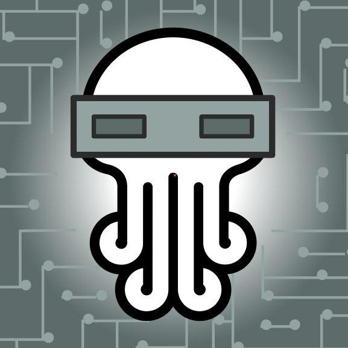

# nim-telegram-bot

- Easy `*.INI` and `*.MD` Customization.
- Single Binary, ~128 Kilobytes size. Tiny CPU & Net use. No dependencies (compiled).




### Compile

Get the Code:

```bash
git clone https://github.com/juancarlospaco/nim-telegram-bot.git
cd nim-telegram-bot/src/
```

Compile:

```bash
nim c -d:release --opt:size -d:ssl nim_telegram_bot.nim
strip --strip-all nim_telegram_bot
```

**Optional** (compress binary, half size):

```bash
upx --best --ultra-brute nim_telegram_bot
```


### Run

```bash
./nim_telegram_bot
```


### Requisites

*For Compilation only!, if it compiles it does not need Nim nor Telebot.*

- [Nim](https://nim-lang.org/install_unix.html)
- [Telebot](https://github.com/ba0f3/telebot.nim) [`nimble install telebot`](https://nimble.directory/pkg/telebot)

You can hack any of the `*.INI` and `*.MD` on the `/src/` folder to customize.
